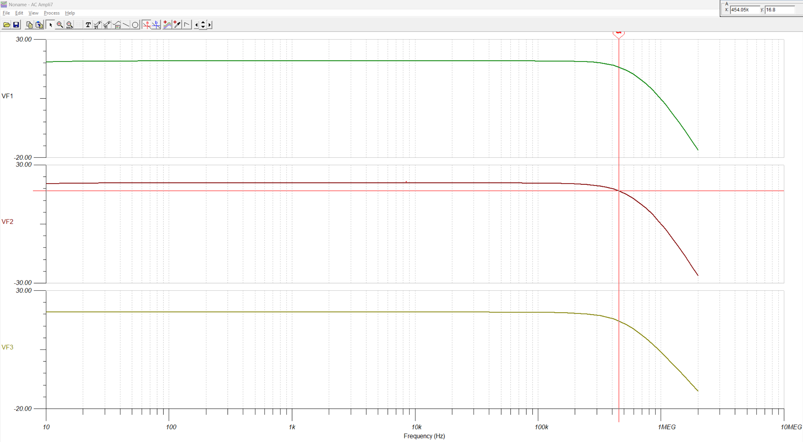
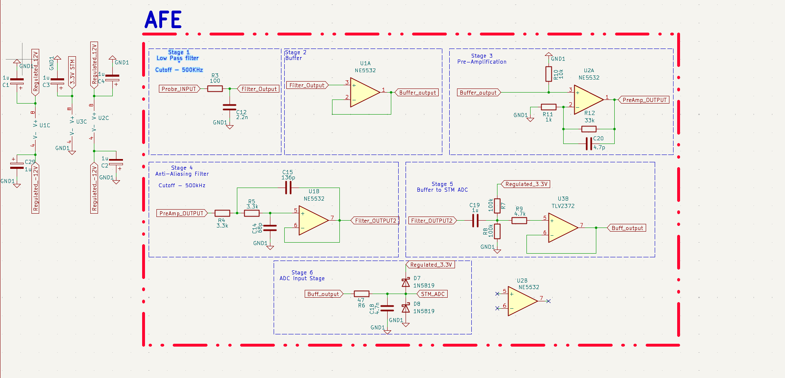

# STM32 Oscilloscope Analog Front-End

Analog front-end for conditioning millivolt-level signals for a 3.3 V STM32 ADC.

Designed in KiCad, simulated in TINA, and prototyped on a breadboard.

## Specifications

| Parameter | Value |
|---|---:|
| Gain | 10 V/V |
| Passband gain | 20.8 dB |
| Sallen–Key cutoff | ~450 kHz |
| ADC-output bandwidth | ~505 kHz |
| ADC bias | 1.65 V |
| ADC range | 0–3.3 V |

## Signal Path

`Input` → `Low-Pass Filter` → `Buffer` → `34× Amplifier` → `Sallen–Key Filter` → `1.65 V Bias` → `ADC Buffer` → `STM32 ADC`

## Simulation

- `VF3` — Sallen–Key output
- `VF1` — ADC buffer output
- `VF2` — STM32 ADC input

## Hardware

[View schematic](hardware/AFE.pdf)

[Watch demonstration](media/demo.mp4)
